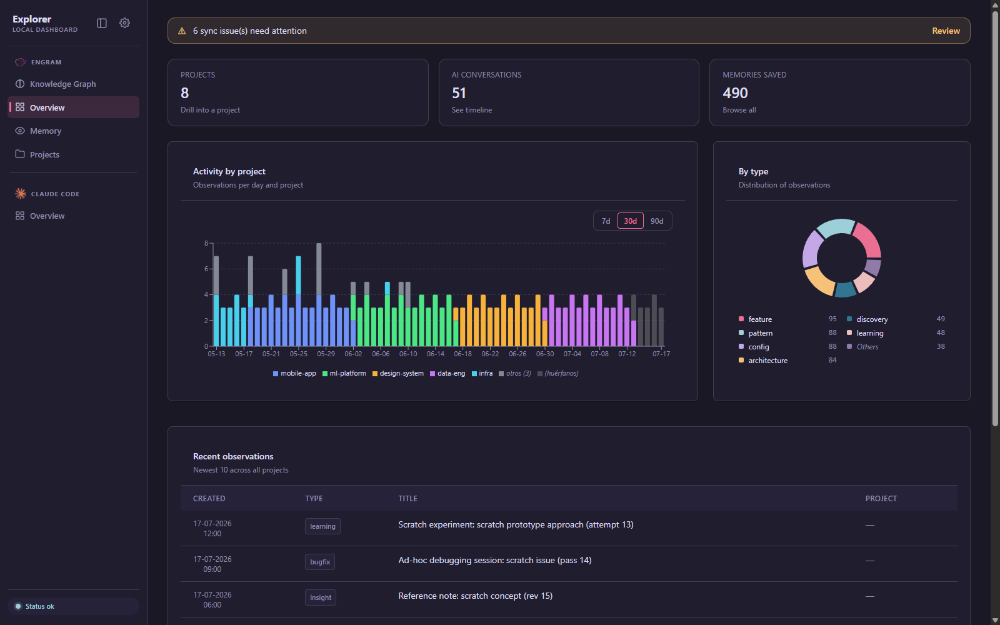
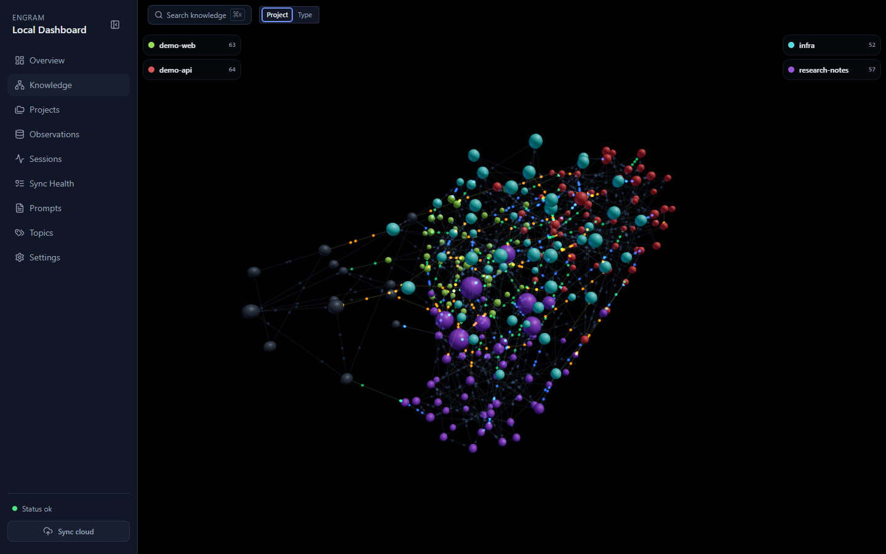

<div align="center">

# 🧠 Engram Explorer

### See your agent's brain.

A local-first dashboard for [**Engram**](https://github.com/Gentleman-Programming/engram) — explore your AI agent's long-term memory as a live 3D neural map, diagnose sync problems, and fix capture bugs the CLI can't even show you.

[](https://github.com/AlvaroQ/engram-explorer/releases/latest)
[](https://github.com/AlvaroQ/engram-explorer/releases)
[](./LICENSE)
[](https://go.dev)

<br />

[**⬇️ Download**](#-download--run-90-seconds) · [**🧠 The Brain**](#-the-brain--your-memory-as-a-3d-neural-map) · [**📊 What it shows**](#-what-it-surfaces) · [**🛠️ Build from source**](#-build-from-source)

<br />



</div>

---

## ⚡ Why this exists

Engram stores your agents' long-term memory in a local SQLite database (`~/.engram/engram.db`). The official TUI/CLI is great for **capture and recall** — but it can't _show_ you the **shape** of that memory, nor the operational problems hiding inside it: orphan projects, broken cloud sync, thousands of pending mutations, observations captured without a project.

Engram Explorer reads that database **directly** — read-only by default, so it never blocks the daemon's writes — and surfaces all of it across **13 views** in **Spanish and English**, light or dark. It can also apply targeted, **user-confirmed** fixes (reassign a stray observation, rename a project, prune junk) through a guarded write path you can switch off entirely.

> **One binary, one SQLite file.** No Node.js runtime, no WebView2, no sidecar. Download the binary for your platform, point it at your database, open your browser.

---

## 📥 Download & run (90 seconds)

You **don't need to clone or compile anything**. Grab the binary for your OS from the [latest release](https://github.com/AlvaroQ/engram-explorer/releases/latest) and run it.

| Platform       | Download                                                                                                                                                                                                                                 | Run it                                                                        |
| -------------- | ---------------------------------------------------------------------------------------------------------------------------------------------------------------------------------------------------------------------------------------- | ----------------------------------------------------------------------------- |
| 🍎 **macOS**   | [`engram-explorer_*_darwin_arm64.tar.gz`](https://github.com/AlvaroQ/engram-explorer/releases/latest) (Apple Silicon)<br />[`engram-explorer_*_darwin_amd64.tar.gz`](https://github.com/AlvaroQ/engram-explorer/releases/latest) (Intel) | `tar -xzf engram-explorer_*.tar.gz`<br />`./engram-explorer`                  |
| 🐧 **Linux**   | [`engram-explorer_*_linux_amd64.tar.gz`](https://github.com/AlvaroQ/engram-explorer/releases/latest) (or `arm64`)                                                                                                                        | `tar -xzf engram-explorer_*.tar.gz`<br />`./engram-explorer`                  |
| 🪟 **Windows** | [`engram-explorer_*_windows_amd64.zip`](https://github.com/AlvaroQ/engram-explorer/releases/latest)                                                                                                                                      | Unzip → double-click `engram-explorer.exe`<br />_(or run it from PowerShell)_ |

Then open **<http://127.0.0.1:8787>** in your browser. That's it. 🎉

### 🍺 One-liner for macOS / Linux (Homebrew)

If you have [Homebrew](https://brew.sh):

```bash
brew install AlvaroQ/tap/engram-explorer
engram-explorer
```

> **On Windows?** There is no Homebrew step — and you don't need one. Homebrew on Windows requires WSL2 and adds friction for zero benefit. Just download the `.zip` from the table above, unzip it, and run the `.exe`. A single native binary, exactly like macOS and Linux.

### 🧩 Do I need Engram installed?

**No — it's optional.** The dashboard starts even with no data source and walks you through setup on first run (see [First-run onboarding](#first-run-onboarding)). But to see _your own_ memory, install Engram:

```bash
# macOS / Linux
brew install gentleman-programming/tap/engram
engram serve   # creates ~/.engram/engram.db on first run
```

> The `engram serve` daemon is **not required** to run the dashboard — it reads the SQLite file directly and degrades gracefully when the daemon is offline. Only the live sync/health panels need it.

### 👀 Just want to look around first? (demo data)

No Engram, no real data needed — seed a realistic demo database and explore every view. Requires [building from source](#-build-from-source):

```bash
go run ./cmd/seed-demo                       # generates ./demo/engram.db
ENGRAM_DATA_DIR=./demo ./engram-explorer     # run against the demo data
```

---

## 🧠 The Brain — your memory as a 3D neural map



This is the centerpiece. **The Brain renders every observation in your database as a node in a live, force-directed 3D graph** — organized by **project**.

- 🌐 **Each project becomes a lobe.** Observations from the same project cluster together in space — one vivid colored region per project, dozens of them, each its own part of the brain.
- 🔵 **Each sphere is a single memory.** Its size reflects weight (and how many duplicates were deduped into it); its color encodes either the **project** or the **observation type** — a toggle you control.
- ⚡ **Synapses connect related memories.** Edges carry GPU-driven particle flow — the brain literally "breathes" — with relationship and confidence baked into how each connection looks.
- 🔎 **Hover any neuron to read it.** A detail card surfaces the memory's title, tags, project, and date right in the 3D scene; click through for the full markdown and `[[wikilinks]]`.
- 🚀 **Fast by design.** Force layout runs off-main-thread in a Web Worker, rendering uses a single instanced mesh on a demand frameloop, particles are GPU-driven — smooth even with hundreds of nodes on screen.

> The Brain keeps evolving toward a **deeper, drillable neural architecture** — immersive navigation into the clusters your memory forms as it grows.

---

## 📊 What it surfaces

13 views, all server-rendered, all in EN/ES + light/dark:

| View                  | What you get                                                                                                              |
| --------------------- | ------------------------------------------------------------------------------------------------------------------------- |
| 🏠 **Overview**       | At-a-glance counts (projects, sessions, observations, prompts), activity-by-project chart, type distribution, sync health |
| 🧠 **Brain**          | The 3D neural map above                                                                                                   |
| 📁 **Projects**       | Per-project memory, activity, and sync state                                                                              |
| 📄 **Project detail** | Full memory and session timeline for a single project                                                                     |
| 💭 **Observations**   | Every memory, filterable, with full markdown + wikilinks                                                                  |
| 🕑 **Sessions**       | Session timeline and per-session detail                                                                                   |
| ✍️ **Prompts**        | Captured user prompts, searchable                                                                                         |
| 🏷️ **Topics**         | Memory grouped by stable `topic_key`                                                                                      |
| ☁️ **Sync Health**    | Cloud enrollment: enrolled / healthy / broken / pending mutations                                                         |
| 🔄 **Sync project**   | Per-project cloud sync detail and mutation queue                                                                          |
| 🧹 **Orphans**        | Observations captured without a project — the capture bugs the CLI can't show                                             |
| 🩺 **Diagnostics**    | Orphan projects, broken sync — a diagnostic engine across all views                                                       |
| ⚙️ **Settings**       | UI preferences, language, theme, Modules (provider toggles), Accounts (profiles)                                          |

---

## 🔗 Relationship to Engram

Engram Explorer is a **community companion** — a read-only viewer and operational dashboard built on top of [Engram](https://github.com/Gentleman-Programming/engram). It is **not** an official plugin, not a fork, and not affiliated with Gentleman Programming.

The official plugin ecosystem talks to the daemon over HTTP at `127.0.0.1:7437`. Engram Explorer takes a different approach: it reads the SQLite file directly in **WAL read-only mode**, so it runs whether or not the daemon is active and **never competes with `engram serve` as the authoritative owner of the database**. When the daemon is running, the dashboard respects it — it only proxies the daemon's own telemetry endpoints (`/health`, `/sync/status`, `/stats`) and, for user-confirmed cloud operations, shells out to the `engram` CLI the same way you would from a terminal.

> The CLI captures and recalls; this shows you the _shape_ of what your agent has remembered. It complements the official tooling — it doesn't replace it.

---

## 🛠️ Build from source

> Only needed if you want to contribute, run the demo seeder, or build a custom binary. **Most users should just [download a release](#-download--run-90-seconds).**

### Requirements

- **Go 1.25+** — matches the `go` directive in `go.mod` (minimum required by `modernc.org/sqlite` and `golang.org/x/sync`)
- **Node.js 20+ and pnpm 10+** — to build the React island bundles (not needed at runtime)
- **`templ` CLI** — optional; generated `*_templ.go` files are committed, so `go build ./...` works without it

### Path A — Try it with demo data (no Engram required)

```bash
git clone https://github.com/AlvaroQ/engram-explorer.git
cd engram-explorer

make build                                # frontend → embed → go build
go run ./cmd/seed-demo                     # seed a realistic demo DB
ENGRAM_DATA_DIR=./demo ./engram-explorer   # run against demo data
# open http://127.0.0.1:8787
```

### Path B — Use your real Engram database

```bash
git clone https://github.com/AlvaroQ/engram-explorer.git
cd engram-explorer

make build            # frontend → embed → go build
./engram-explorer     # reads ~/.engram/engram.db by default
# open http://127.0.0.1:8787
```

Health check: `curl http://127.0.0.1:8787/api/health`

### Run without building the binary (Go installed)

```bash
make frontend embed          # frontend must be built first for the Go embed
go run ./cmd/engram-explorer
```

### Build targets

| Target          | What it does                                                                              |
| --------------- | ----------------------------------------------------------------------------------------- |
| `make build`    | Full build: `templ generate` → `vite build` (islands) → Tailwind CSS → embed → `go build` |
| `make frontend` | Build React island bundles only                                                           |
| `make embed`    | Copy `apps/frontend/dist/` into `internal/web/dist/` for `go:embed`                       |
| `make dev`      | Run the Go binary in dev mode                                                             |
| `make test`     | Run all Go tests                                                                          |
| `make clean`    | Remove the binary and the embedded dist copy                                              |

---

## 🏗️ Architecture

Engram Explorer is a **single Go binary** (`cmd/engram-explorer`) serving all views on one port (default `127.0.0.1:8787`). It opens the Engram SQLite database with two `modernc.org/sqlite` handles (pure-Go, no CGo): a **read-only** pool (`mode=ro` + `query_only`) that serves every view and coexists safely with the live WAL written by the daemon, and a single-connection **read-write** pool that powers a small set of explicit, user-confirmed mutations. API routes (`/api/*`) run on an `internal/httpapi` mux built on Go's standard `net/http`. The backend proxies the daemon's telemetry endpoints (`/health`, `/sync/status`, `/stats`) and — when the user explicitly confirms a cloud enroll/sync — shells out to the `engram` CLI. Set `ENGRAM_DASH_READONLY=true` to disable the write path entirely.

**The primary UI is server-rendered** using [templ](https://templ.guide) and [HTMX](https://htmx.org) in `internal/ui`. Go handlers load data via the services layer → render templ templates (full-page on navigation, partial fragment on HTMX requests via the `HX-Request` header). Interactivity (filters, pagination, drawers) is driven by `hx-get`/`hx-post`/`hx-swap`. Long lists use server-side cursor-based pagination with `hx-trigger="revealed"` — no client-side virtualization.

**React islands** handle the two surfaces not portable to HTMX: the 3D brain graph (React Three Fiber + Three.js + a Web Worker for force layout) and the activity/type charts (Recharts). Islands live in `apps/frontend/src/islands/`, each exporting a `mount(el, props)` function, built by Vite (multi-entry) to stable paths (`/islands/<name>.js`) and embedded via `go:embed` in `internal/web/`.

i18n is server-side: a Go loader over `internal/ui/locales/{en,es}.json` with `T(lang, key, args...)`; language resolved from the `lang` cookie → `Accept-Language` header → `"en"`. Theme is applied via a `theme` cookie read at render time.

### Tech stack

| Layer             | Stack                                                                                 |
| ----------------- | ------------------------------------------------------------------------------------- |
| **Backend**       | Go · `net/http` · `modernc.org/sqlite` (read-only, pure-Go, no CGo) · `log/slog`      |
| **UI (primary)**  | templ + HTMX · server-rendered · cursor pagination · i18n (en/es) · Tailwind v3       |
| **React islands** | React 19 · Vite multi-entry · each island exports `mount(el,props)`                   |
| **Brain island**  | React Three Fiber · Three.js · drei · Web Worker force layout · GPU particle synapses |
| **Charts island** | Recharts · activity-by-project, project-activity, type-breakdown                      |
| **Distribution**  | Single binary · `go:embed` · GoReleaser · Homebrew tap                                |

---

## 🚦 First-run onboarding

When you start Engram Explorer for the first time — or any time no data source is active — the dashboard shows an **onboarding screen** instead of an error. It does not exit and does not require Engram to be installed.

It lists the auto-detected Tier-1 providers (Engram database, Claude Code projects directory), offers a manual path field for any not detected, and activates the first provider you configure — transitioning straight to the overview, no restart required.

---

## 🧩 Modules

**Modules** are the data-source providers Engram Explorer can connect to. Manage them in **Settings → Modules**.

| Provider                 | ID            | What it reads                                    | Default auto-detect path                         |
| ------------------------ | ------------- | ------------------------------------------------ | ------------------------------------------------ |
| **Engram**               | `engram`      | SQLite database written by the Engram daemon     | `~/.engram/engram.db` (or `$ENGRAM_DATA_DIR`)    |
| **Claude Code Sessions** | `cc-sessions` | JSONL session transcripts written by Claude Code | `~/.claude/projects` (or `$CLAUDE_PROJECTS_DIR`) |

Both are **Tier-1**: if not found at their default paths the UI keeps them visible with a path entry field, so you can point the dashboard at a non-default location without restarting. **Tier-2 providers** (planned) are silent auto-detect only; none ship in the current release.

**Provider states:** `enabled` (open and serving) · `detected` (found, not yet activated) · `disabled` (toggled off) · `errored` (failed to open — check the path) · `registered` (known, detection not attempted).

**To activate a Tier-1 provider manually:** Settings → Modules → find the `detected`/`registered` row → enter the path → **Validate & Activate**. On success it becomes `enabled` and its sidebar section appears immediately; the path is persisted to `~/.engram/config.json`.

---

## 👤 Accounts

**Accounts** are named configuration profiles. Each stores a discrete set of provider paths and activation states, so you can keep separate setups for (say) a personal Engram database and a work one. Manage them in **Settings → Accounts**.

- **Create:** Settings → Accounts → name it → **Create** → configure providers in Settings → Modules.
- **Switch:** click **Switch** next to the profile (or use the sidebar account switcher when ≥2 profiles exist). Switches are **hot-swap** — no restart; in-flight requests complete against the previous profile first.
- **Default profile:** created automatically on first run, seeded from env vars and the legacy `~/.engram/explorer-settings.json` if present, so existing users see no change after upgrading.
- **Persistence:** active profile name and all settings live in `~/.engram/config.json` and are restored on restart.

If a profile references a path that no longer exists, that provider is marked **unavailable** with an inline warning; other providers still load normally.

---

## ⚙️ Configuration

### Environment variables

| Env var                    | Default                 | Purpose                                                                            |
| -------------------------- | ----------------------- | ---------------------------------------------------------------------------------- |
| `ENGRAM_DATA_DIR`          | `~/.engram`             | Directory containing `engram.db`; also the location of `config.json`               |
| `CLAUDE_PROJECTS_DIR`      | `~/.claude/projects`    | Directory where Claude Code stores session transcripts                             |
| `DASHBOARD_HOST`           | `127.0.0.1`             | HTTP bind address                                                                  |
| `DASHBOARD_PORT`           | `8787`                  | HTTP listen port                                                                   |
| `ENGRAM_PORT`              | `7437`                  | Port of the local `engram serve` daemon (used when `ENGRAM_DAEMON_URL` is not set) |
| `ENGRAM_DAEMON_URL`        | `http://127.0.0.1:7437` | Full base URL of the Engram daemon (overrides `ENGRAM_PORT`)                       |
| `ENGRAM_DAEMON_TIMEOUT_MS` | `1500`                  | HTTP timeout for daemon proxy calls (milliseconds)                                 |
| `LOG_LEVEL`                | `info` / `debug` in dev | Logging verbosity: `debug`, `info`, `warn`, `error`                                |
| `ENGRAM_DASH_ENV`          | `production`            | Set to `development` to expose internal error details in API responses             |
| `ENGRAM_DASH_READONLY`     | `false`                 | Set to `true` to disable all mutating routes (returns `503`)                       |

### config.json (persistent settings)

Provider paths and account profiles are stored at `$ENGRAM_DATA_DIR/config.json` (default `~/.engram/config.json`), written atomically on every change. **You don't need to edit it manually — the Settings UI writes it for you.**

**Precedence** (highest wins): **1.** environment variable → **2.** `config.json` active profile → **3.** legacy `explorer-settings.json` (read once on first run to seed the default) → **4.** built-in default. Existing users relying on env vars see no change.

---

## ✏️ Editing your memory

Engram Explorer is **read-first**: every view works against the read-only pool and never touches your data. On top of that it offers a few **explicit, user-confirmed** edits so you can fix the problems it surfaces without dropping to the CLI:

- **Edit an observation** — fix its title, type, `topic_key`, or content.
- **Reassign project** — move a stray observation/session/prompt to the right project.
- **Delete** — soft-delete an observation, or remove an empty session/prompt.
- **Rename / merge a project** — re-tag every row from one project name to another.
- **Import / export** — download a SQLite snapshot, or merge another Engram DB in (a safety backup is written next to your DB first).

Every mutation is confirmed in the UI, goes through a guarded write path, and runs inside a transaction. Because `engram serve` is the authoritative owner:

> The read path is always safe alongside a running daemon. For **destructive or bulk** edits (project rename/merge, DB import) prefer stopping the daemon first, and keep a backup.

For a strict viewer with **no** write capability, start with `ENGRAM_DASH_READONLY=true` — the read-write pool is never opened and every mutating endpoint returns `503`. See [SECURITY.md](./SECURITY.md) for the full concurrency contract.

---

## 🩹 Troubleshooting

<details>
<summary><strong>No data sources detected on first run</strong></summary>

The dashboard shows the **onboarding screen** instead of crashing. From there you can activate Engram or Claude Code Sessions. If you have Engram but it isn't auto-detected: go to **Settings → Modules** and enter the path to `engram.db`, or set `ENGRAM_DATA_DIR=/path/to/dir` before starting.

To get a real DB: `brew install gentleman-programming/tap/engram && engram serve`. To try demo data: `go run ./cmd/seed-demo`, then `ENGRAM_DATA_DIR=./demo ./engram-explorer`.

</details>

<details>
<summary><strong>Dashboard shows "daemon offline"</strong></summary>

The local `engram serve` daemon isn't reachable. The dashboard degrades gracefully — all read views stay functional against the SQLite file. Start the daemon with `engram serve` to recover the live `/health`, `/sync/status`, and `/stats` panels. (`/api/sync/issues` showing `DAEMON_DOWN HIGH` is the same root cause.)

</details>

<details>
<summary><strong>Port already in use (<code>address already in use</code>)</strong></summary>

Another process is bound to port 8787.

- **macOS / Linux:** `lsof -ti :8787 | xargs kill -9`
- **Windows:** `netstat -ano | findstr :8787`, then `taskkill /F /PID <id>`

Or use a different port: `DASHBOARD_PORT=9090 ./engram-explorer`.

</details>

<details>
<summary><strong>Sync diagnostics (<code>SYNC_BROKEN HIGH</code>, empty project name)</strong></summary>

**`SYNC_BROKEN HIGH`** — `lifecycle='pending'` with `last_acked_seq=0` while `last_enqueued_seq>0`: mutations queued but never acknowledged. Common causes: cloud token not set, network partition, cloud-side rejection. Check `last_error` / `reason_message` on `/sync/<project>`.

**Project with empty name (`""`)** — observations captured without a project context. This is an upstream capture bug in the agent or MCP that emitted them; the dashboard can't fix it. Inspect the `session_id` of the affected rows and patch the captor.

</details>

<details>
<summary><strong>Cloud mutations (<code>CLI_NOT_FOUND</code>, <code>429</code>)</strong></summary>

**`CLI_NOT_FOUND`** — `engram` is not on `$PATH` for the user running the dashboard. Install it system-wide or run the dashboard from a shell where `engram --version` resolves.

**`429 Rate limit exceeded`** — cloud mutation endpoints are rate-limited; the `Retry-After` header tells you how long to wait.

</details>

---

## 📦 Releases & changelog

Versioned binaries and per-release changelogs are published on [GitHub Releases](https://github.com/AlvaroQ/engram-explorer/releases). Built with GoReleaser from `v*` tags — macOS, Linux, and Windows artifacts plus a Homebrew tap.

---

## 📂 Project layout

<details>
<summary>Expand the full directory tree</summary>

```
engram-explorer/
├── Makefile                        # Build targets: build, dev, test, clean
├── go.mod                          # module github.com/AlvaroQ/engram-explorer
├── cmd/
│   ├── engram-explorer/            # Binary entry point — config → container → serve
│   └── seed-demo/                  # Demo database seeder (generates ./demo/engram.db)
├── internal/
│   ├── config/                     # Env-var config, ProfileStore, EnsureConfig
│   ├── httpapi/                    # net/http mux, routes, middleware, container (/api/*)
│   ├── providers/                  # Provider port + Registry (state-machine, hot-swap)
│   │   ├── engram/                 # Engram provider adapter (SQLite, daemon proxy, health)
│   │   ├── ccsessions/             # Claude Code Sessions provider adapter (JSONL reader)
│   │   └── providertest/           # FakeProvider + test helpers
│   ├── ui/                         # templ+HTMX server-rendered UI (all pages)
│   │   ├── locales/                # en.json, es.json
│   │   └── static/                 # app.css (Tailwind), styles.css, htmx.min.js
│   ├── doctor/                     # Diagnostic module: /doctor/sync, /doctor/orphans
│   ├── services/                   # SQL service layer (observations, sessions, sync, …)
│   ├── sqlite/                     # Read-only + read-write connection pools
│   ├── daemon/                     # HTTP client for the engram serve daemon
│   ├── cursor/                     # Opaque cursor-based pagination
│   ├── fts/                        # FTS5 query sanitizer
│   ├── logging/                    # log/slog setup
│   └── web/                        # go:embed of built islands+assets
├── apps/
│   └── frontend/                   # React islands via Vite multi-entry (build-time only)
│       └── src/
│           ├── islands/            # brain.tsx, *-chart.tsx (each exports mount(el,props))
│           ├── components/brain/   # R3F 3D neural graph
│           ├── components/charts/  # recharts wrappers
│           └── loader.ts           # mounts islands from <div data-island data-props>
└── testdata/
    └── schema/engram-schema.sql    # Reference schema for Go integration tests
```

</details>

---

## 📄 License

MIT — see [LICENSE](./LICENSE).
